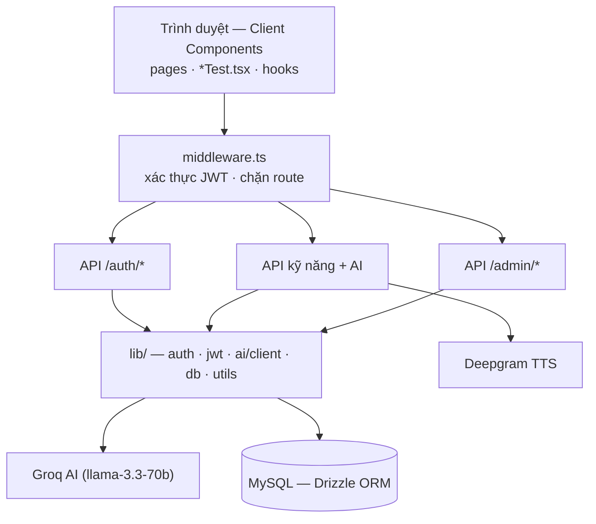

# hutechIELTShacker — Tài liệu Chức năng & Kiến trúc

Tài liệu mô tả chi tiết kiến trúc, chức năng từng file, luồng xử lý và sơ đồ use case của dự án luyện thi IELTS **hutechIELTShacker**.

> Cập nhật theo mã nguồn hiện tại: provider AI là **Groq** (`llama-3.3-70b-versatile`) qua endpoint OpenAI-compatible. Tên biến môi trường vẫn giữ tiền tố `FIREWORKS_*` vì lý do lịch sử, nhưng có thể trỏ tới **bất kỳ endpoint OpenAI-compatible nào** (Groq / OpenAI / Gemini / Fireworks).

---

## I. Công nghệ

| Lớp | Công nghệ |
|---|---|
| Framework | Next.js 15 (App Router), React 19, TypeScript |
| Giao diện | TailwindCSS, shadcn/ui, lucide-react |
| CSDL | MySQL + Drizzle ORM (driver `mysql2`) |
| Xác thực | JWT (thư viện `jose`, HS256), cookie httpOnly |
| AI | Groq LLM qua API OpenAI-compatible (gọi bằng `fetch` trực tiếp) |
| Khác | Web Speech API (ghi âm Speaking), Deepgram TTS (đọc bài nghe) |

---

## II. Sơ đồ Use Case


- **Học viên / Khách dùng thử**: đăng nhập → làm bài 4 kỹ năng, dùng AI hỗ trợ, chat AI, xem tiến độ.
- Mỗi *Làm bài* «include» các use case AI (chấm điểm, gợi ý, giải thích) — đều gọi tới **Groq AI**.
- **Admin**: quản lý (CRUD) đề thi 4 kỹ năng.
- **MySQL**: lưu tài khoản, đề thi và mọi bài nộp.

---

## III. Sơ đồ Kiến trúc & Luồng xử lý




---

## IV. Chi tiết từng file

### 1. Cấu hình & hạ tầng
| File | Chức năng |
|---|---|
| `package.json` | Dependencies + scripts: `dev`, `build`, `db:push`, `db:seed`, `db:studio` |
| `next.config.ts`, `tailwind.config.ts`, `tsconfig.json` | Cấu hình Next / Tailwind / TypeScript |
| `drizzle.config.ts` | Trỏ Drizzle Kit tới schema + DB để generate/push migration |
| `.env.example` | Mẫu biến môi trường: `DATABASE_URL`, `JWT_SECRET`, `FIREWORKS_*`, `DEEPGRAM_API_KEY` |
| `.gitignore` | Chặn commit `.env.local`, `node_modules`, `.next`, `*.tsbuildinfo` |
| `middleware.ts` | **Gác cổng**: đọc cookie JWT; chưa đăng nhập → `/login`; đã đăng nhập vào trang auth → `/dashboard`; non-admin vào `/admin` → `/dashboard` |

### 2. Tầng `src/lib/` (logic dùng chung)
| File | Chức năng |
|---|---|
| `lib/jwt.ts` | Khóa JWT + tên cookie dùng chung (edge-safe). **Throw nếu thiếu `JWT_SECRET` ở production** (không throw lúc build) |
| `lib/auth.ts` | `hashPassword`/`verifyPassword` (**PBKDF2 600.000 vòng**, lưu số vòng trong hash để tương thích ngược); `createSession`/`deleteSession`/`getSessionPayload`; `getCurrentUser`; `isAdmin` |
| `lib/ai/client.ts` | **Lõi AI.** `generateAIText`, `generateAIJson` (JSON mode + `parseLooseJson` tự sửa lỗi JSON), `streamChatText` (stream cho chat). Tự thêm `reasoning_effort: "none"` cho model thinking. Chứa toàn bộ **prompt template** 4 kỹ năng |
| `lib/db/index.ts` | Khởi tạo connection pool Drizzle + MySQL |
| `lib/db/schema.ts` | 9 bảng: `users`, `*_tests`/`reading_passages`, `*_questions`, `*_submissions` |
| `lib/db/seed.ts` | Nạp đề thi mẫu (8 writing + reading + listening + speaking) |
| `lib/utils.ts` | `cn`, `formatTime`, `countWords`, `isAnswerCorrect`, `bandToColor`, `bandToLabel` |
| `types/index.ts` | Kiểu dùng chung: `WritingScoreResult`, `SpeakingScoreResult`, `Profile`... |

### 3. API Routes (`src/app/api/`)
| Route | Method | Chức năng |
|---|---|---|
| `auth/register` | POST | Đăng ký: kiểm trùng email → băm mật khẩu → tạo user → mở session |
| `auth/login` | POST | Đăng nhập: xác thực mật khẩu → ký JWT vào cookie |
| `auth/guest` | POST | Tạo tài khoản khách `guest_xxx@trial.com` (hash rỗng) → mở session |
| `auth/me` / `auth/logout` | GET / POST | Lấy user hiện tại / xóa session |
| `writing/score` | POST | AI chấm 4 tiêu chí + bài cải thiện band 8 → lưu `writing_submissions` |
| `writing/check-grammar` | POST | AI dò lỗi ngữ pháp + bài sửa |
| `writing/ideas` | POST | AI gợi ý dàn bài + từ vựng học thuật |
| `reading/submit` | POST | Chấm trắc nghiệm (`isAnswerCorrect`) → lưu `reading_submissions` |
| `reading/explain` | POST | AI **gợi ý** (`mode:hint`, trước nộp) / **giải thích** (`mode:explain`, sau nộp). **Dùng chung cho Listening** |
| `listening/submit` | POST | Chấm + lưu `listening_submissions` |
| `speaking/score` | POST | AI chấm 4 tiêu chí từ transcript → lưu `speaking_submissions` |
| `speaking/sample` | POST | AI bài mẫu band 8 + từ vựng |
| `chat` | POST | Chat AI streaming (edge runtime) |
| `tts` | POST | Gọi Deepgram đọc transcript thành audio |
| `admin/{writing,reading,speaking,listening}` | GET/POST/PUT/DELETE | CRUD đề thi, chặn bằng `isAdmin()` |

### 4. Components (`src/components/`)
| File | Chức năng |
|---|---|
| `writing/WritingEditor.tsx` | Soạn bài, đếm từ, timer; nút **AI dàn bài** & **AI sửa lỗi**; hiển thị band + feedback + bài cải thiện; xử lý lỗi AI (nút thử lại) |
| `reading/ReadingTest.tsx` | Passage + form trả lời; nút **AI gợi ý/giải thích** mỗi câu |
| `listening/ListeningTest.tsx` | Player audio/TTS + sóng âm + transcript; **nút AI gợi ý/giải thích mỗi câu** |
| `speaking/SpeakingTest.tsx` | Ghi âm (Web Speech), AI đọc câu hỏi, chấm điểm, **bài mẫu AI**; xử lý lỗi AI |
| `layout/Sidebar.tsx`, `layout/Header.tsx` | Điều hướng + đăng xuất; tiêu đề trang |
| `ui/*` | shadcn/ui (button, card, badge, input, textarea, progress, tabs) + `MarkdownRenderer` |

### 5. Pages (`src/app/`) & Hooks
| File | Chức năng |
|---|---|
| `(app)/layout.tsx` | Layout học viên (Sidebar + nội dung) |
| `(app)/dashboard/page.tsx` + `SkillsGrid.tsx` | Thống kê (bài đã làm, giờ, band TB) + lưới 4 kỹ năng |
| `(app)/{skill}/page.tsx` | Danh sách đề (DB, fallback mock) |
| `(app)/{skill}/[id]/page.tsx` | Server load đề theo id → render component test |
| `(app)/writing/custom/page.tsx` | Tự nhập đề writing để luyện |
| `(app)/chat/page.tsx` | Chat AI realtime (đọc text stream, render Markdown) |
| `(auth)/login`, `(auth)/register` | Form đăng nhập/đăng ký + nút khách |
| `admin/*` | Trang quản trị CRUD đề thi 4 kỹ năng |
| `hooks/useTimer.ts` | Đồng hồ đếm ngược làm bài |
| `hooks/useSpeech.ts` | Ghi âm + nhận dạng giọng nói (Web Speech API) cho Speaking |
| `hooks/useLanguage.ts` | Chuyển ngôn ngữ VI/EN (lưu localStorage) |

---

## V. Các workflow chính

### A. Xác thực
```
Đăng ký/Đăng nhập → API băm/kiểm mật khẩu (PBKDF2 600k)
  → createSession ký JWT → set cookie httpOnly "session"
  → middleware đọc cookie cho mọi request → bảo vệ route
Khách dùng thử: tạo user tạm (passwordHash rỗng) → mở session ngay
```

### B. Làm bài + AI (luồng cốt lõi)
```
Chọn đề → [id]/page.tsx (server load từ DB)
  → *Test.tsx (client) + useTimer chạy đồng hồ
  → Bấm nút AI → fetch /api/{skill}/...
        → generateAIJson / generateAIText → Groq → parse → trả về UI
  → Nộp bài → /api/{skill}/score | submit
        → chấm (AI hoặc isAnswerCorrect) → lưu *_submissions → hiển thị kết quả
```

### C. Quản trị (Admin)
```
/admin (middleware kiểm role admin)
  → trang gọi /api/admin/{skill} (mỗi handler tự isAdmin())
  → CRUD bảng tests/questions
  → đề mới isPublished=true xuất hiện ở trang học viên
```

### D. Chat AI
```
/chat → POST /api/chat (edge runtime)
  → streamChatText chuyển SSE của Groq thành text stream
  → client đọc từng chunk, render Markdown realtime
```

---

## VI. Ghi chú vận hành AI (quan trọng)

- App đọc cấu hình AI từ env (`FIREWORKS_API_KEY`, `FIREWORKS_BASE_URL`, `AI_MODEL`) — đổi provider chỉ cần sửa `.env.local`, **không cần sửa code**.
- Cấu hình hiện tại: **Groq** `https://api.groq.com/openai/v1`, model `llama-3.3-70b-versatile`.
- `generateAIJson` dùng `response_format: json_object` (Groq yêu cầu prompt có chữ "JSON" — các prompt đều có) và `parseLooseJson` để chống lỗi JSON (thiếu dấu phẩy, fence markdown).
- Các route chấm điểm trả **HTTP 502 + `{error}`** khi AI lỗi (không còn trả điểm giả "6.0"); UI hiển thị lỗi + nút thử lại.
- Lưu ý nếu đổi sang model có "thinking" (Gemini 2.5, o-series): `client.ts` tự gửi `reasoning_effort: "none"` để tránh thinking-token làm cắt cụt JSON.
- Trước khi deploy production: **bắt buộc đặt `JWT_SECRET`** (`openssl rand -base64 48`).
